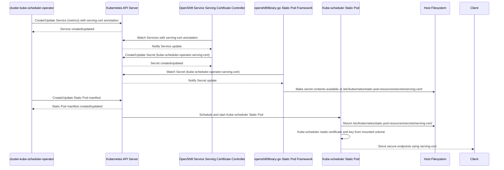

# serving-cert Secret 管理分析

本文档分析了 `cluster-kube-scheduler-operator` 项目中 `serving-cert` Secret 的管理方式、创建、更新机制、使用场景以及过期时间。

## Secret 名称

在本项目中，与 `serving-cert` 相关的 Secret 实际名称为 `kube-scheduler-operator-serving-cert`。

## 创建与更新机制

`kube-scheduler-operator-serving-cert` Secret 的创建和更新并非由 `cluster-kube-scheduler-operator` 直接负责，而是由 OpenShift 内置的服务服务证书机制触发和管理。这一机制的触发点是 `metrics` Service 对象上的特定注解：

```yaml
# manifests/0000_25_kube-scheduler-operator_02_service.yaml
apiVersion: v1
kind: Service
metadata:
  annotations:
    include.release.openshift.io/self-managed-high-availability: "true"
    include.release.openshift.io/single-node-developer: "true"
    service.beta.openshift.io/serving-cert-secret-name: kube-scheduler-operator-serving-cert # 此注解触发 Secret 的创建和管理
    exclude.release.openshift.io/internal-openshift-hosted: "true"
  labels:
    app: openshift-kube-scheduler-operator
  name: metrics
  namespace: openshift-kube-scheduler-operator
spec:
  ports:
  - name: https
    port: 443
    protocol: TCP
    targetPort: 8443
  selector:
    app: openshift-kube-scheduler-operator
  sessionAffinity: None
  type: ClusterIP
```

当 `cluster-kube-scheduler-operator` 创建或更新带有此注解的 Service 时，OpenShift 服务服务证书控制器（可能是 `cert-manager Operator` 或相关平台组件的一部分）会检测到此注解，并负责：

1.  为该 Service 生成 TLS 证书和密钥。
2.  在同一命名空间 (`openshift-kube-scheduler-operator`) 中创建或更新一个名为 `kube-scheduler-operator-serving-cert` 的 Secret，其中包含生成的证书 (`tls.crt`) 和密钥 (`tls.key`)。
3.  管理证书的续期，确保在过期前进行更新。

因此，证书的过期时间由 OpenShift 平台的服务服务证书机制负责管理。

## 使用场景

`serving-cert` Secret 用于为 kube-scheduler 的安全端点提供 TLS 证书，特别是用于暴露在 10259 端口的 metrics 端点。`metrics` Service 提供了一个稳定的 ClusterIP 和端口 (443)，将流量转发到 kube-scheduler Pod 的目标端口 (8443，通过 Pod 定义中的 `hostNetwork: true` 和容器端口映射到 10259)。

`cluster-kube-scheduler-operator` 中的 `targetconfigcontroller` 负责配置 kube-scheduler 静态 Pod 使用此证书。它会检查是否存在一个名为 "serving-cert" 的 Secret，如果存在，则向 kube-scheduler 容器添加必要的命令行参数：

```go
// pkg/operator/targetconfigcontroller/targetconfigcontroller.go
	if _, err := secretsGetter.Secrets(required.Namespace).Get(ctx, "serving-cert", metav1.GetOptions{}); err != nil && !apierrors.IsNotFound(err) {
		return nil, false, err
	} else if err == nil {
		required.Spec.Containers[0].Args = append(required.Spec.Containers[0].Args, "--tls-cert-file=/etc/kubernetes/static-pod-resources/secrets/serving-cert/tls.crt")
		required.Spec.Containers[0].Args = append(required.Spec.Containers[0].Args, "--tls-private-key-file=/etc/kubernetes/static-pod-resources/secrets/serving-cert/tls.key")
	}
```

kube-scheduler 静态 Pod 配置了一个 `hostPath` 卷，将宿主机上的 `/etc/kubernetes/static-pod-resources/kube-scheduler-pod-REVISION` 路径挂载到容器内的 `/etc/kubernetes/static-pod-resources`：

```yaml
# bindata/assets/kube-scheduler/pod.yaml
  volumes:
  - hostPath:
      path: /etc/kubernetes/static-pod-resources/kube-scheduler-pod-REVISION
    name: resource-dir
  volumeMounts:
    - mountPath: /etc/kubernetes/static-pod-resources
      name: resource-dir
```

`openshift/library-go` 的静态 Pod 管理框架负责将由服务服务证书控制器创建的 `kube-scheduler-operator-serving-cert` Secret 的内容，在宿主机文件系统上提供到 `/etc/kubernetes/static-pod-resources/kube-scheduler-pod-REVISION/secrets/serving-cert/` 路径。这使得 kube-scheduler 容器可以在其文件系统内通过 `/etc/kubernetes/static-pod-resources/secrets/serving-cert/` 路径访问证书和密钥。

## 项目中的管理角色

本项目在 `serving-cert` Secret 的管理中主要扮演声明和消费的角色：

1.  通过在 `metrics` Service 中定义 `service.beta.openshift.io/serving-cert-secret-name` 注解，声明需要 OpenShift 创建和管理该 Secret。
2.  `targetconfigcontroller` 配置 kube-scheduler 静态 Pod，使其使用静态 Pod 资源卷中预期路径下的证书和密钥。
3.  本项目使用的 `openshift/library-go` 静态 Pod 框架处理将 Secret 内容提供到宿主机文件系统供静态 Pod 使用的底层机制。

静态 Pod 中包含的 `cert-syncer` 容器根据代码分析用于同步其他证书 (`kube-scheduler-client-cert-key`)，似乎不直接参与 `serving-cert` 的生命周期。

## 时序图

以下时序图展示了 `serving-cert` Secret 的管理流程：

